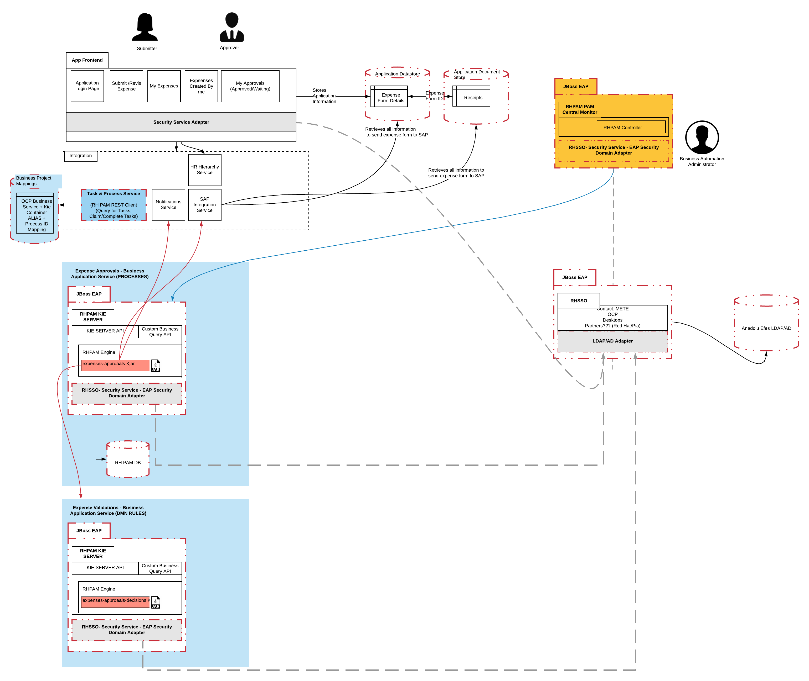

# RHPAM 7.x Spring Boot Secured Application Example
:toc:

This a setup of multiple microservices to provide client, business process and business rule execution with integrations secured via RHSSO

## Application Components

.Expenses Application Architecture

.List of Application Components
====
[width="100%",options="header"]
|===
| Name | Type | Purpose | Services | Port 
| notifications-service-task
| rhpam service task
| Creates a notification from a Business Process BPMN Diagram
| N/A
| N/A

| sap-expenses-service-task
| rhpam service task
| Creates an integration (dummy) to SAP 
| N/A
| N/A

| expenses-model
| data model
| The data model shared between microservices for Expenses
| N/A
| N/A

| expenses-approvals-kjar
| rhpam kjar (business process)
| The RHPAM Business Process Project with BPMN for Expense Approvals
| N/A
| N/A

| expenses-validations-kjar
| rhpam kjar (business rules)
| The RHPAM Business Rules Project with DMN for Expense Approvals
| N/A
| N/A

| pam-client-service
| spring boot service (business process)
| The Spring Boot service to expose KIE Server with Business Process expenses-approvals-kjar
| pam-client-service
| 8090

| hr-expenses-business-application-service
| spring boot service (business rules)
| The Spring Boot service to expose KIE Server with Business Rules expenses-validations-kjar
| hr-expenses-business-application-service
| 8090

| hr-expenses-validations-service
| spring boot service (rhpam api client)
| The Spring Boot service to expose KIE Server APIs for Business Purposes
| hr-expenses-validations-service
| 8090

| pam-mysql
| database
| The MYSQL Database for the Spring Boot service KIE Server with Business Process
| pam-mysql
| 3306

| rhsso
| EAP
| SSO (persisted in PostgreSQL) with clients for the Spring Boot Services and users/roles to access and execute them
| sso-init / secured-sso-init & sso-init-postgresql
| 8080 / 5432
|
|===
====

### Build Applications

.Build Application Components
====
[width="100%",options="header"]
|===
| Component | Build 
| notifications-service-task
| mvn clean install -s settings.xml (local or nexus configured)

| sap-expenses-service-task
| mvn clean install -s settings.xml (local or nexus configured)

| expenses-model
| mvn clean install -s settings.xml (local or nexus configured)

| expenses-approvals-kjar
| mvn clean install -s settings.xml (local or nexus configured)

| expenses-validations-kjar
| mvn clean install -s settings.xml (local or nexus configured)

| pam-client-service
| mvn clean install -s settings.xml (local or nexus configured)

| hr-expenses-business-application-service
| mvn clean install -s settings.xml (local or nexus configured)

| hr-expenses-validations-service
| mvn clean install -s settings.xml (local or nexus configured)
|===
====

## Microservices Setup

### Microservices Local Setup

	SSO_ROUTE=http://localhost:8080
	PAM_CLIENT_SERVICE_ROUTE_URL=http://localhost:8091
	BUSINESS_PROCESS_KIESERVER_ROUTE_URL=http://localhost:8092

1. RHSSO Setup

* based on EAP:

	bin/standalone.sh -Dkeycloak.migration.action=import -Dkeycloak.migration.provider=singleFile -Dkeycloak.migration.file=keycloak-export-exepnse-approvals.json -Dkeycloak.migration.usersExportStrategy=REALM_FILE -Dkeycloak.migration.strategy=OVERWRITE_EXISTING -Dkeycloak.profile.feature.upload_scripts=enabled
	
* or based on Docker: 

	docker run --rm\
    --name sso-init\
    -p 8080:8080\
    -v /home/stkousso/Stelios/Projects/Events/2020/RHPAM-TEKTON/CUSTOMER-GIT-REPOS/rhsso:/tmp:Z\
    jboss/keycloak:10.0.0\
    -Dkeycloak.migration.action=import\
    -Dkeycloak.migration.provider=singleFile\
    -Dkeycloak.migration.file=/tmp/keycloak-export-exepnse-approvals.json\
    -Dkeycloak.migration.strategy=OVERWRITE_EXISTING\
    -Dkeycloak.migration.usersExportStrategy=REALM_FILE\
    -Dkeycloak.profile.feature.upload_scripts=enabled
    
2. Service Deployments 

* Start `hr-expenses-validations-service`

	java -jar  -Dspring.profiles.active=h2 -Dserver.port=8093 \
	  -Dorg.drools.server.filter.classes=true \
	  -Dorg.kie.server.startup.strategy=LocalContainersStartupStrategy \
	  -Dorg.kie.server.mode=PRODUCTION \
	  -Dkie.maven.settings.custom=~/.m2/settings.xml \
	  -Dorg.guvnor.m2repo.dir=~/.m2/repository \
	  target/hr-expenses-validations-business-service-1.0.0.jar

* Start `hr-expenses-business-application-service`

	java -jar  -Dspring.profiles.active=h2 -Dserver.port=8092 \
	  -DSSO_AUTH_SERVER_URL=http://localhost:8080 \
	  -Dorg.drools.server.filter.classes=true \
	  -Dorg.kie.server.startup.strategy=LocalContainersStartupStrategy \
	  -Dorg.kie.server.mode=PRODUCTION \
	  -Dkie.maven.settings.custom=~/.m2/settings.xml \
	  -Dorg.guvnor.m2repo.dir=~/.m2/repository \
	  -DSERVICE_NAME=http://localhost:8093/rest/server \
	  -DSERVICE_USERNAME=user \
	  -DSERVICE_PASSWORD=user \
	  target/hr-expenses-business-application-service-1.0.0.jar

* Start `pam-client-service`

	java -jar  -Dspring.profiles.active=local -Dserver.port=8091 \
	  -DSSO_AUTH_SERVER_URL=http://localhost:8080 \
	  -Dexpenses.process.service.url=http://localhost:8092/rest/server \
	  -Dexpenses.validation.service.url=http://localhost:8093/rest/server \
	  target/pam-client-service-1.0.0.jar
    

### Microservices Local Docker (compose)  Setup

	SSO_ROUTE=http://localhost:8080
	PAM_CLIENT_SERVICE_ROUTE_URL=http://localhost:8091
	BUSINESS_PROCESS_KIESERVER_ROUTE_URL=http://localhost:8092

* Images available at link:quay.io/skoussou[Quay Registry] For preperation of images see link:prep-images.adoc[prep-images.adoc]

* Start all components:

	$ docker-compose up

This executes all configurations set forth by the link:docker-compose.yaml[`docker-compose.yaml`] file. Follow xref:anchor-1[Scenarios Test].

* Stop all components:

	$ docker-compose stop

### Microservices Openshift  Setup

1. MYSQL Database creation for Spring Boot (Business Process) KIE Server `hr-expenses-business-application-service`

	oc new-app --template=mysql-ephemeral -p DATABASE_SERVICE_NAME=pam-mysql -p MYSQL_USER=jbpm -p MYSQL_PASSWORD=jbpm -p MYSQL_ROOT_PASSWORD=root -p MYSQL_DATABASE=jbpm -n <NAMESPACE>
	
2. RHSSO Setup

	oc create -f rhsso/service.sso.expenses-approvals.yaml -n <NAMESPACE>
	
3. Service Deployments `pam-client-service`, `hr-expenses-business-application-service`, `hr-expenses-validations-service`

	mvn oc:deploy -Djkube.namespace=<NAMESPACE> -DskipTests=true -P openshift -Dmaven.artifact.threads=50 -s settings.xml  (local or nexus configured)
	
4. Test

	SSO_ROUTE=https://$(oc get routes secure-sso-init -o jsonpath='{.spec.host}')
	PAM_CLIENT_SERVICE_ROUTE_URL=http://$(oc get routes pam-client-service -o jsonpath='{.spec.host}')
	BUSINESS_PROCESS_KIESERVER_ROUTE_URL=http://$(oc get routes hr-expenses-business-application-service -o jsonpath='{.spec.host}')

* Create JWT Token

	RESULT=$(curl -sk -X POST $SSO_ROUTE/auth/realms/master/protocol/openid-connect/token   -d grant_type=password   -d username=stelios  -d password=stelios   -d client_id=pam-client-service   -d client_secret=bcf90d5f-56e5-4515-b1db-3cf95e9e3207)
	export TOKEN=$( jq -r ".access_token" <<<"$RESULT")	
	
* Request Example

        PAM_CLIENT_SERVICE_ROUTE_URL=http://$(oc get routes pam-client-service -o jsonpath='{.spec.host}')
	curl --location --request POST "$PAM_CLIENT_SERVICE_ROUTE_URL/rhpam/process/ExpensesApproval" --header "Authorization: Bearer $TOKEN" -H  "accept: application/json" -H  "content-type: application/json"   -d  "{\"listOfExpenseItems\":[{\"expenseType\":\"Food\",\"expenseValue\":100000},{\"expenseType\":\"Taxi\",\"expenseValue\":26000},{\"expenseType\":\"Accommodation\",\"expenseValue\":10000}],\"departmentRole\":\"HR Manager\",\"departmentName\":\"HR\",\"expenseSubmitterID\":\"PetraJones-35324\",\"expenseFormCorrelationKey\":\"expenseReport-62\",\"expenseOwnerID\":\"NickWatkins-0253\",\"expenseOwnerNotificationAddress\":\"nick.watkings@redhat.com\",\"financialAffairsDirectorApproverUsername\":\"fadirectorapprover\",\"firstApproverUsername\":\"firstapprover\",\"secondApproverUsername\":\"secondapprover\"}"
	
## Scenarios Test

* See Description of Microservices
** see link:pam-client-service/README.adoc[pam-client-service] the available APIs
** see link:expenses-approvals-kjar/README.adoc[expenses-approvals-kjar] for the diagram of the Business process

[[anchor-1]]
### Process an Expense Claim

	SSO_ROUTE=https://$(oc get routes secure-sso-init -o jsonpath='{.spec.host}')
	PAM_CLIENT_SERVICE_ROUTE_URL=http://$(oc get routes pam-client-service -o jsonpath='{.spec.host}')
	BUSINESS_PROCESS_KIESERVER_ROUTE_URL=http://$(oc get routes hr-expenses-business-application-service -o jsonpath='{.spec.host}')

1. Start the claim 

	RESULT=$(curl -sk -X POST $SSO_ROUTE/auth/realms/master/protocol/openid-connect/token   -d grant_type=password   -d username=stelios  -d password=stelios   -d client_id=pam-client-service   -d client_secret=bcf90d5f-56e5-4515-b1db-3cf95e9e3207)
	export TOKEN=$( jq -r ".access_token" <<<"$RESULT")
	curl --location --request POST "$PAM_CLIENT_SERVICE_ROUTE_URL/rhpam/process/ExpensesApproval" --header "Authorization: Bearer $TOKEN" -H  "accept: application/json" -H  "content-type: application/json"   -d  "{\"listOfExpenseItems\":[{\"expenseType\":\"Food\",\"expenseValue\":100000},{\"expenseType\":\"Taxi\",\"expenseValue\":26000},{\"expenseType\":\"Accommodation\",\"expenseValue\":10000}],\"departmentRole\":\"HR Manager\",\"departmentName\":\"HR\",\"expenseSubmitterID\":\"PetraJones-35324\",\"expenseFormCorrelationKey\":\"expenseReport-62\",\"expenseOwnerID\":\"NickWatkins-0253\",\"expenseOwnerNotificationAddress\":\"nick.watkings@redhat.com\",\"financialAffairsDirectorApproverUsername\":\"fadirectorapprover\",\"firstApproverUsername\":\"firstapprover\",\"secondApproverUsername\":\"secondapprover\"}"

2. First Approver Approval

	RESULT=$(curl -sk -X POST $SSO_ROUTE/auth/realms/master/protocol/openid-connect/token   -d grant_type=password   -d username=firstapprover  -d password=firstapprover   -d client_id=pam-client-service   -d client_secret=bcf90d5f-56e5-4515-b1db-3cf95e9e3207)
	export TOKEN=$( jq -r ".access_token" <<<"$RESULT")
	curl -X POST $PAM_CLIENT_SERVICE_ROUTE_URL/rhpam/task/1/COMPLETE  -d "{\"approvalStatus\":\"Approved\",\"approvalMessage\":\"I approve this report\", \"taskContainerId\":\"expenses-approvals-kjar-0.6.0\",\"actionUserId\":\"firstapprover\",\"processId\":\"ExpensesApproval\"}" -H "content-type: application/json" --header "Authorization: Bearer $TOKEN"
+
* Get the diagram of the process state and view it in the browser

	curl -X GET "$BUSINESS_PROCESS_KIESERVER_ROUTE_URL/rest/server/containers/com.redhat:expenses-approvals-kjar:0.6.0/images/processes/instances/1" --output process1.svg --header "Authorization: Bearer $TOKEN"  -H "content-type: application/json" -H "accept: application/svg+xml"

2. Second Approver Approval

	RESULT=$(curl -sk -X POST $SSO_ROUTE/auth/realms/master/protocol/openid-connect/token   -d grant_type=password   -d username=secondapprover  -d password=secondapprover   -d client_id=pam-client-service   -d client_secret=bcf90d5f-56e5-4515-b1db-3cf95e9e3207)
	export TOKEN=$( jq -r ".access_token" <<<"$RESULT")
	curl -X POST $PAM_CLIENT_SERVICE_ROUTE_URL/rhpam/task/2/COMPLETE  -d "{\"approvalStatus\":\"Approved\",\"approvalMessage\":\"I approve this report\", \"taskContainerId\":\"expenses-approvals-kjar-0.6.0\",\"actionUserId\":\"secondapprover\",\"processId\":\"ExpensesApproval\"}" -H "content-type: application/json" --header "Authorization: Bearer $TOKEN"
+
* Get the diagram of the process state and view it in the browser

	curl -X GET "$BUSINESS_PROCESS_KIESERVER_ROUTE_URL/rest/server/containers/com.redhat:expenses-approvals-kjar:0.6.0/images/processes/instances/1" --output process1.svg --header "Authorization: Bearer $TOKEN"  -H "content-type: application/json" -H "accept: application/svg+xml"

3. Financial Director Approval

	RESULT=$(curl -sk -X POST $SSO_ROUTE/auth/realms/master/protocol/openid-connect/token   -d grant_type=password   -d username=fadirectorapprover  -d password=fadirectorapprover   -d client_id=pam-client-service   -d client_secret=bcf90d5f-56e5-4515-b1db-3cf95e9e3207)
	export TOKEN=$( jq -r ".access_token" <<<"$RESULT")
	curl -X POST $PAM_CLIENT_SERVICE_ROUTE_URL/rhpam/task/3/COMPLETE  -d "{\"approvalStatus\":\"Approved\",\"approvalMessage\":\"I approve this report\", \"taskContainerId\":\"expenses-approvals-kjar-0.6.0\",\"actionUserId\":\"fadirectorapprover\",\"processId\":\"ExpensesApproval\"}" -H "content-type: application/json" --header "Authorization: Bearer $TOKEN"
+	
* Get the diagram of the process state and view it in the browser

	curl -X GET "$BUSINESS_PROCESS_KIESERVER_ROUTE_URL/rest/server/containers/com.redhat:expenses-approvals-kjar:0.6.0/images/processes/instances/1" --output process1.svg --header "Authorization: Bearer $TOKEN"  -H "content-type: application/json" -H "accept: application/svg+xml"
	
4. Financial Department Approval		

		RESULT=$(curl -sk -X POST $SSO_ROUTE/auth/realms/master/protocol/openid-connect/token   -d grant_type=password   -d username=findepapprover2  -d password=findepapprover2   -d client_id=pam-client-service   -d client_secret=bcf90d5f-56e5-4515-b1db-3cf95e9e3207)
	export TOKEN=$( jq -r ".access_token" <<<"$RESULT")
	curl -X POST $PAM_CLIENT_SERVICE_ROUTE_URL/rhpam/task/4/COMPLETE  -d "{\"approvalStatus\":\"Approved\",\"approvalMessage\":\"I approve this report\", \"taskContainerId\":\"expenses-approvals-kjar-0.6.0\",\"actionUserId\":\"findepapprover2\",\"processId\":\"ExpensesApproval\"}" -H "content-type: application/json" --header "Authorization: Bearer $TOKEN"
+
* Get the diagram of the process state and view it in the browser

	curl -X GET "$BUSINESS_PROCESS_KIESERVER_ROUTE_URL/rest/server/containers/com.redhat:expenses-approvals-kjar:0.6.0/images/processes/instances/1" --output process1.svg --header "Authorization: Bearer $TOKEN"  -H "content-type: application/json" -H "accept: application/svg+xml"
	

